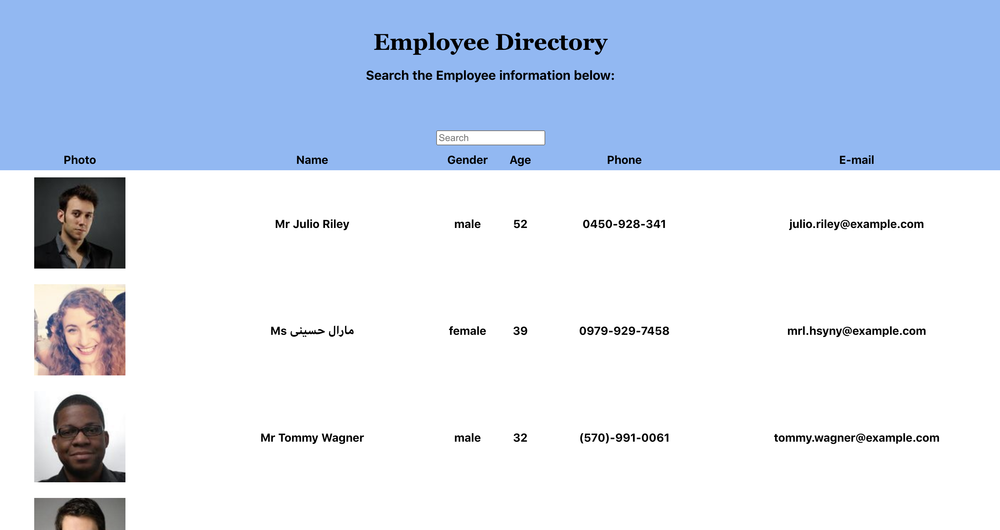

## Employee-Directory 

### Description
Employee-Directory is an application that lets a manager or a company filter or view non-sensitive data about other employees.

### `npm start`

Runs the app in the development mode. 
Open [http://localhost:3000](http://localhost:3000) to view it in the browser.

The page will reload if you make edits. 
You will also see any lint errors in the console.

### License:
(https://img.shields.io/badge/license-MIT-blue.svg)

### A sample Application 

### Contributing
Ahmed Bule

### Questions:
For any questions, feel free to email me at ahmedbule01@gmail.com

